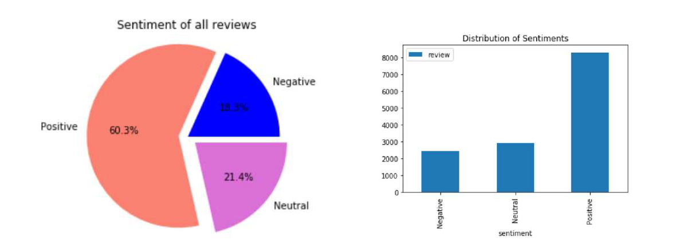

# Sentiment Analysis HEALTHCARE Service Reviews

# Overview
Healthcare Service Review is a tool to predict the sentiment of the reviews posted by patients. In this project, we will classify a review as Positive or Negative based on its sentiment.

# Datasets and Inputs
We are using the Yelp reviews from the Yelp Academic Dataset from kaggle(https://www.kaggle.com/yelp-dataset/yelp-dataset). It has five JSON files categorized as business, review, checkin, tip, and users. For our project, we are using business and review files. The business file contains records related to different businesses and roughly about 209393 different businesses are present in the file. The second file, the review contains reviews about the different businesses and contains roughly about 8021122 reviews. The reviews span from 2009 – 2018. Our main goal is to concentrate only on business related to Medical, so we are extracting only medical business from the first JSON file i.e, business file. There are roughly 276 businesses related to medicine. Then we extracted reviews for these businesses from the review file. We got roughly 13676 reviews.

# Packages
The project is build in Spark using PySpark and MLlib library.

# Approach
Before doing analysis on reviews, we are applying different text mining process. To simplify the problem, we will consider that a review with a score of 4 or 5 is positive and a review with a score of 1 - 3 is negative.

**1. Data Preparation - Text Mining**

As part of text mining, we are doing case normalization, tokenization, stop word removal, punctuations removal, stemming, and TFIDF. 
    
- Case Normalization: first we will normalize the reviews to make sure every term is in lower case.

- Tokenization: In this step we will generate tokens for the normalized text. This list of tokens is taken as input for the further process.

- Stop Word Removal: Stop words are basically a set of commonly used words in any language, not just English. The stop words are critical to many applications, if we remove the stop words that are very commonly used in any given language, then we can focus on the important words instead. In our project we will remove stop words before calculating TF-IDF.

- Punctuations Removal : In this phase we are removing punctuations and empty spaces from the text.

- Stemming: In this phase we will use a stemming algorithm to reduce variant forms of a word to a common form.

**2. Calculation of TF-IDF**

We implemented TF-IDF using pyspark. The Term Frequency is the number of times the word occurs in a review. TF - IDF creates a sparse metrics format RDD which is highly efficient in storage and computation as it only stores the places where there is a value hence in case of data sparsity sparse metric RDD is efficient.

Before implementing TF-IDF, we are splitting the dataset into training and test set. The training set contains 80% of data and the test set contains 20% of data.

# Sentimental Analysis using VADER sentiment library
To analyze the sentiment, we are using the VADER sentiment library in python. To calculate the score of the sentiment we are using a popular sentiment analysis library.

Vader Sentiment library provides four scores for a given text mentioned below:
1. Compound: It represents the polarity of the statement/text given ranging from 0 to 1
2. Negative: Negative sentiment score of the text given ranging from 0 to 1
3. Positive: Positive sentiment score of the text given ranging from 0 to 1
4. Neutral: Neutral sentiment score of the text given ranging from 0 to 1

## Output of VADER Analysis

# Modelling and Evaluation

To predict positive or negative reviews based on the TF-IDF feature, we built two different algorithms – Logistic Regression and Naive Bayes. We are using accuracy as the model evaluation metrics. We are using HashingTF -IDF and CountVectorizer – IDF calculate the term frequency for IDF. We have implemented Logistic Regression with HashingTF -IDF, CountVectorizer and N-gram.

N-gram implementation produced a result of the accuracy of 91.5% and ROC-AUC of 97.15%.

## Output 

| Algorithms                                  | Accuracy  | ROC-AUC |
| ------------------------------------------- |:---------:| -------:|
| HashingTF-IDF with Logistic Regression      |   90.4%   | 96.10%  |
| CountVectorizer-IDF with Logistic Regression|   90.9%   | 96.14%  |
| N-gram with Logistic Regression             |   91.5%   | 97.15%  |
| HashingTF -IDF with Naive Bayes             |   89%     |  90%    |

Then the files are deployed to AWS Hadoop Master Node using SCP command. 
